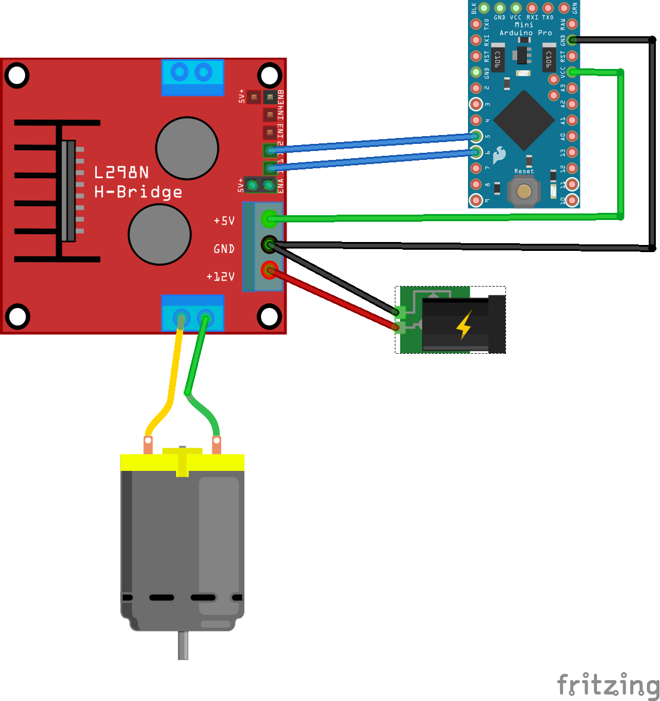

# MotorDriver Library for Arduino

Allows Arduino boards to control an analog motor using a dual H Bridge motor controller such as the L298N Dual Motor Controller Module (2 pin module) or (3 Pin Board Name) (3 pin module) per motor.

To use it you will need an analog motor and the appropriate hardware to control it.

## MotorDriver Constructors
### 2 Pin Motor Controller - MotorDriver(forwardPin, reversePin)
Purpose: Instantiate a MotorDriver using two control connections (forward and reverse). Both Arduino pins need to be PWM capable. 
```
testMotor = new MotorDriver(6, 5)
```
### 3 Pin Motor Controller - MotorDriver(forwardEnable, reverseEnable, speedPin)
Purpose: Instantiate a MotorDriver using three control connections (forward, reverse, speed). The forward and reverse pins are digtal (0, 1) and the speedPin must be PWM capable.
```
testMotor = new MotorDriver(7, 8, 6)
```
## Motor Driver Methods
### stop()
Purpose: Stop the motor if it is moving.
```
testMotor.stop();
```
### forward()
Purpose: Start the motor in the forward direction. (Speed is dictated by the setSpeed value.)
```
testMotor.forward();
```
### reverse()
Purpose: Start the motor in the reverse direction. (Speed is dictated by the setSpeed value.)
```
testMotor.reverse();
```
### setSpeed(int)
Purpose: Control the speed of the motor by changing the current supplied to the the motor through the H Bridge. Value provided to the method is an integer between 0 and 255. The value that is ultimately used will be limited by the maxSpeed value which defaults to 255 but can be set using the setMaxSpeed method.
```
testMotro.setSpeed(155);
```
### setMaxSpeed(int)
Purpose: Limit the maximum voltage which can be applied to the motor by the setSpeed method. If there is an attempt to set a speed value which is above the maxSpeed value the maxSpeed value will be used. The maxSpeed value can be an integer from 0 to 255, with a default value of 255.
```
testMotor.setMaxSpeed(200)
```
## Wiring Diagram
### 2 Pin Motor Controller



### 3 Pin Motor Controller

To Do: create Fritzing Image

## Sample Code
### 2 Pin Motor Controller
```
#include <MotorDriver.h>

MotorDriver testMotor(6, 5);

void setup() {
	Serial.begin(9600);
	while(!Serial); //wait for serial port to connect (needed for Leonardo)
	Serial.println("Starting Motor Sample");
}

void loop() {
	// Limit speed (voltage) of motor
	testMotor.setMaxSpeed(200);

	// Set speed of motor
	testMotor.setSpeed(150);

	Serial.println("Forward 2 seconds");

	// Start forward motion of motor
	testMotor.forward();

	delay(2000);

	Serial.println("Stop Motor 1 second");

	// Stop Motor
	testMotor.stop();

	delay(1000);

	Serial.println("Reverse 1 second");

	// Reverse Motor
	testMotor.reverse();

	delay(1000);

	testMotor.stop();

	delay(500);
}
```